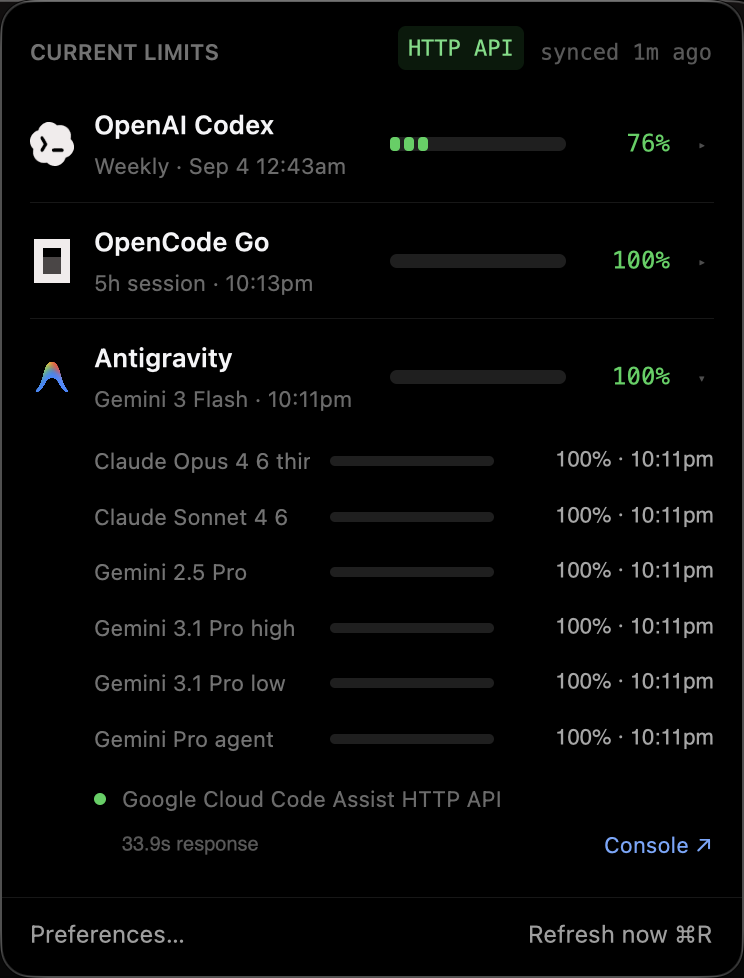
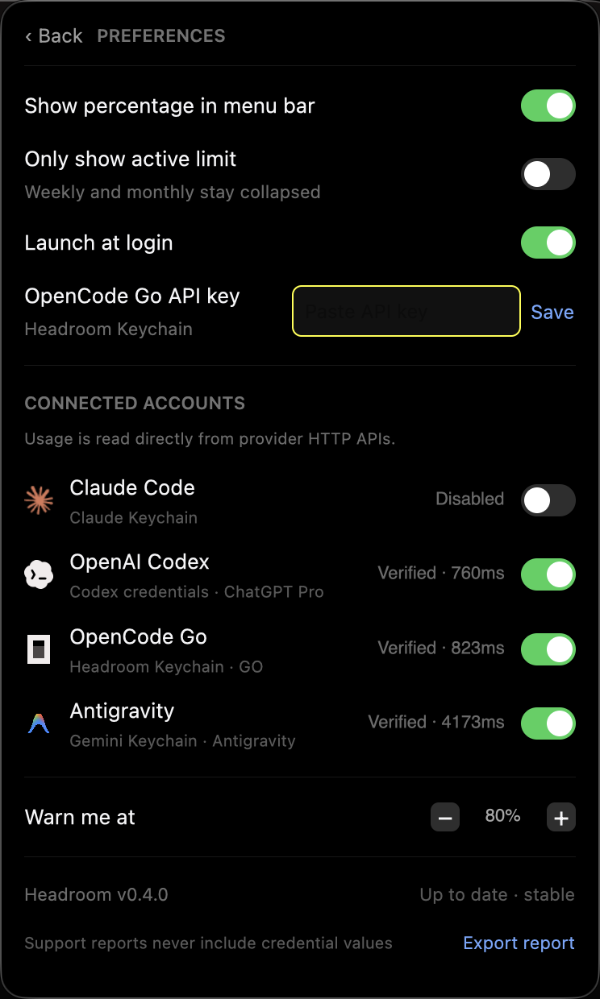

# Headroom

<p align="center">
  <strong>macOS Menu Bar AI Subscription Usage Tracker</strong><br>
  Built with Rust + GPUI · Lightweight · Native Menu-Bar-Only
</p>

---

## Overview

**Headroom** is a native macOS menu bar app written in Rust using [GPUI](https://gpui.rs). It tracks live quota usage across **OpenAI Codex**, **Claude Code**, **OpenCode Go**, and **Google Antigravity** directly from the macOS status bar.

It runs as a pure status-bar accessory (no Dock icon), opens on-demand when clicked, and closes automatically when you click away.

---

## Screenshots

<p align="center">
  
  &nbsp; &nbsp;
  
</p>

---

## Features

- ⚡ **Native Performance**: Built with Rust and GPUI, with pooled HTTP connections and event-driven menu-bar controls.
- 🎯 **Menu-Bar-Only Accessory**: Runs quietly in the macOS top bar without cluttering your Dock (`NSApplicationActivationPolicyAccessory`).
- 🚀 **Auto-Start at Login**: Enable/disable automatic startup at login via CLI or Preferences UI (`LaunchAgents`).
- 📊 **Real-Time Quota Tracking**:
  - **OpenAI Codex**: ChatGPT subscription session, weekly, and model-specific limits from the Codex usage API.
  - **Claude Code**: Live session (5-hour window) and weekly quotas from Anthropic HTTP rate-limit headers.
  - **OpenCode Go**: Rolling (5h), weekly (7d), and monthly (30d) plan usage via `https://opencode.ai/zen/go/v1/usage`.
  - **Google Antigravity**: Quotas and reset countdowns fetched directly from Google Cloud Code Assist (`loadCodeAssist` + `retrieveUserQuota`).
- 🔐 **Secure Credentials**: Uses native Security.framework Keychain access and provider credential stores; token values never appear in diagnostics.
- 🎛️ **Per-Integration Controls**: Disable providers you no longer use; disabled integrations are hidden and never queried until re-enabled.
- 🎨 **Native Brand UI**: Official provider marks, compact dark-mode layout, keyboard navigation, and accessible status labels.
- ✅ **HTTP-Only Usage Collection**: Provider usage never invokes a provider CLI, `curl`, a browser, or a local usage database.
- 🩺 **Diagnostics & Resilience**: Last-good caching, provider backoff, request latency, redacted support reports, and release checks.

### Data-source policy

All displayed usage comes from provider HTTP APIs through Headroom's in-process Rust client. Local files and Keychain are used only to discover credentials. If an authoritative API is unavailable, Headroom shows an error or retains the last-good value; it does not replace quota with a local estimate.

---

## CLI Usage

```bash
# Enable automatic start at login
headroom enable

# Disable automatic start at login
headroom disable

# Run in background (daemonize)
headroom -d

# Print a redacted diagnostics report
headroom --diagnostics

# Show help & version
headroom --help
headroom --version
```

---

## Installation

### Option 1: Homebrew

Install via Homebrew:

```bash
brew tap 4nkitd/tap
brew install --formula 4nkitd/tap/headroom
```

---

### Option 2: Direct App Download (macOS ARM64 / Apple Silicon)

1. Download the app from the [v0.4.0 release](https://github.com/4nkitd/headroom/releases/tag/v0.4.0):
   ```bash
   curl -LO https://github.com/4nkitd/headroom/releases/download/v0.4.0/headroom-v0.4.0-macos-arm64.zip
   ```
2. Unzip and move the app into Applications:
   ```bash
   unzip headroom-v0.4.0-macos-arm64.zip
   mv Headroom.app /Applications/
   open /Applications/Headroom.app
   ```

The public build is ad-hoc signed until Apple distribution credentials are configured. macOS may require **Open Anyway** in Privacy & Security on first launch.

---

### Option 3: Build from Source

#### Prerequisites
- macOS 10.15+ (Apple Silicon or Intel)
- Rust toolchain (`rustc`, `cargo` 1.85+)

#### Steps

```bash
# Clone repository
git clone https://github.com/4nkitd/headroom.git
cd headroom

# Build release binary
cargo build --release

# Enable auto-start at login (optional)
./target/release/headroom enable

# Run Headroom in background
./target/release/headroom -d
```

---

## Configuration & Usage

1. Sign in to the provider apps you want to track. Codex reads `~/.codex/auth.json`; Claude and Antigravity use their existing OAuth stores. OpenCode Go can be configured in Headroom Preferences.
2. Launch **Headroom** — the active provider and remaining quota appear in the macOS menu bar.
3. **Click the menu-bar item** to expand the popover panel.
4. **Preferences**:
    - Toggle **Launch at login** or configure your OpenCode Go API key.
    - Enable or disable each integration independently.
    - Export a redacted support report or open a newer GitHub release.
5. Press `⌘R` inside the popover or click `Refresh now` to manually update quota status.

Headroom refreshes every five minutes. Disabled integrations and providers under backoff are not queried.

---

## License

Apache-2.0 © [4nkitd](https://github.com/4nkitd)
